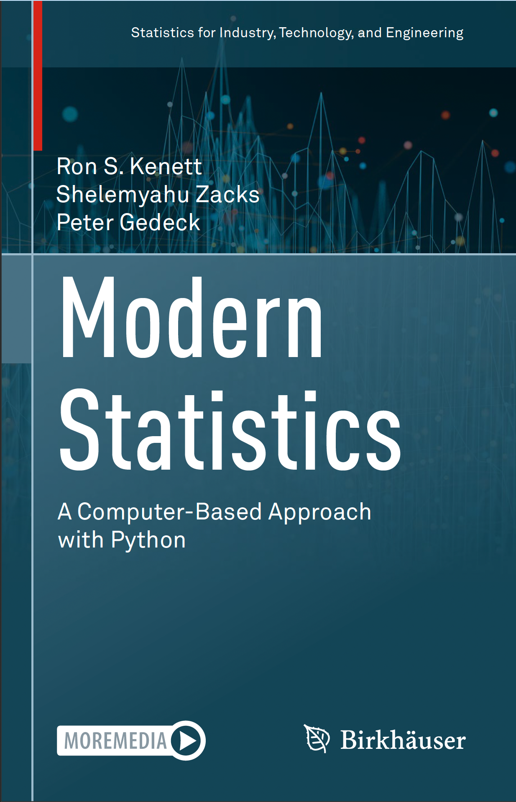

# Modern Statistics
A workbook repo with code + notes as I work through `Modern Statistics: A Computer-Based Approach with Python`



## Start Local Environment
```
conda env create -f environment.yaml
```